# Fluxa Technical Manual


Fluxa is a mobile-first financial companion built with Expo Router, React Native, AWS Amplify Gen 2, AppSync, DynamoDB, S3, Lambda, Cognito, and Plaid. It helps users create an account, complete onboarding, optionally connect bank accounts with Plaid, sync financial data, and view financial summaries, transactions, assets, liabilities, expenses, savings flow, and advisor chat surfaces.

This README is the project’s technical manual. It explains what exists today, why the architecture is shaped this way, how data flows through the system, and how to safely extend the app.

---

## Table Of Contents

- [1. Product Overview](#1-product-overview)
- [2. Architecture At A Glance](#2-architecture-at-a-glance)
- [3. Technology Stack](#3-technology-stack)
- [4. Repository Map](#4-repository-map)
- [5. Frontend Architecture](#5-frontend-architecture)
- [6. Authentication And Session Flow](#6-authentication-and-session-flow)
- [7. Onboarding Flow](#7-onboarding-flow)
- [8. Profile Editing And Image Upload](#8-profile-editing-and-image-upload)
- [9. Plaid Integration](#9-plaid-integration)
- [10. AWS Backend Architecture](#10-aws-backend-architecture)
- [11. Data Model Reference](#11-data-model-reference)
- [12. Data Flow Diagrams](#12-data-flow-diagrams)
- [13. Major Modules And Responsibilities](#13-major-modules-and-responsibilities)
- [14. Setup And Local Development](#14-setup-and-local-development)
- [15. Deployment Guide](#15-deployment-guide)
- [16. Troubleshooting](#16-troubleshooting)
- [17. Security Notes](#17-security-notes)
- [18. Performance And Scalability Notes](#18-performance-and-scalability-notes)
- [19. Developer Notes And Future Work](#19-developer-notes-and-future-work)
- [20. External Documentation](#20-external-documentation)

---

## 1. Product Overview

### What Fluxa Does

Fluxa is a personal finance app. Current core capabilities:

| Capability | Current Implementation |
|---|---|
| Account creation | Cognito email/password auth through Amplify Auth |
| First-time onboarding | Collects name, date of birth, phone number, optional profile image, then optional Plaid connection |
| Profile management | Read-only profile screen with edit modal for name, date of birth, phone, and image |
| Bank linking | Plaid Link native SDK via `react-native-plaid-link-sdk` |
| Transaction sync | Plaid `/transactions/sync` through Lambda |
| Financial snapshot | Lambda calculates assets, liabilities, net worth, cash flow, top category, subscription count |
| Data dashboard | Home, transactions, expenses, assets, liabilities, flow, chat |
| Missing-bank state | Keeps modules visible with placeholder prompts when Plaid is skipped |
| Profile images | Client uploads original to S3; Lambda resizes to 512x512 JPEG and stores processed image |

### Main User Flow

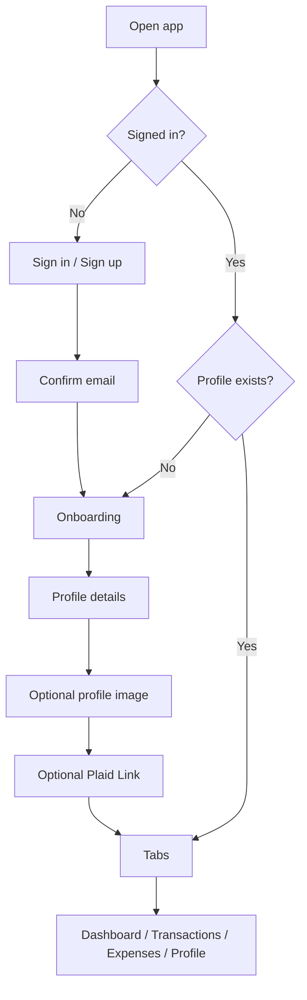

### Architecture Philosophy

Fluxa follows a pragmatic mobile architecture:

- **React Native owns user experience**: screens, overlays, forms, placeholders, local component state.
- **Amplify Auth owns identity**: authentication and user session state are centralized.
- **AppSync/DynamoDB own persistent application data**: profiles, Plaid items, accounts, transactions, snapshots.
- **Lambda owns privileged integrations**: Plaid access tokens, transaction sync, snapshot calculation, profile image processing.
- **S3 owns binary assets**: profile image originals and processed profile images.
- **Plaid Link owns user bank credential flow**: the app never handles bank credentials directly.

The key design choice is separation of concerns: the client can request actions and display data, while sensitive integration work happens in AWS.

---

## 2. Architecture At A Glance

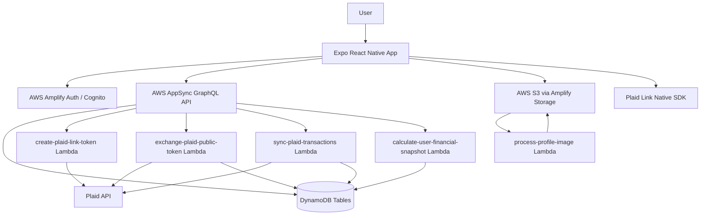

### High-Level Runtime

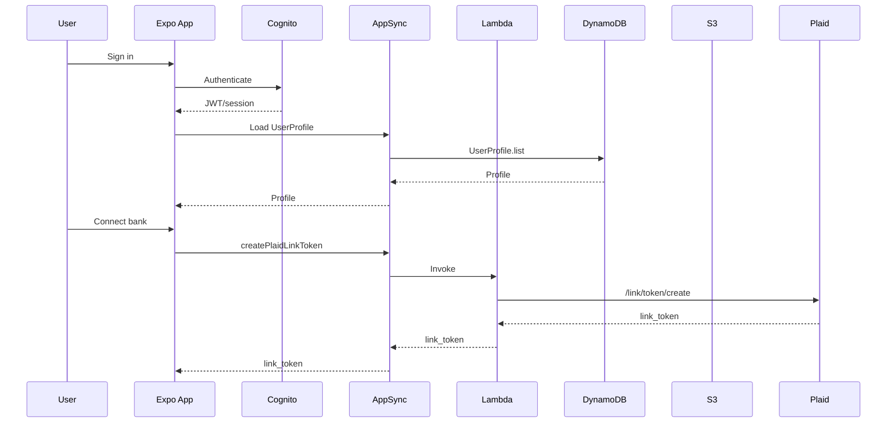

---

## 3. Technology Stack

| Layer | Technology | Why |
|---|---|---|
| Mobile app | Expo, React Native, Expo Router | Fast iteration, native builds when needed, file-based routing |
| Language | TypeScript | Safer app/backend contracts |
| Auth | AWS Cognito through Amplify Auth | Managed user pools and JWT auth |
| API | Amplify Data / AppSync GraphQL | Strong model API with owner authorization |
| Database | DynamoDB generated by Amplify Data | Serverless, owner-scoped model storage |
| Binary storage | Amplify Storage / S3 | Durable private object storage |
| Functions | AWS Lambda | Plaid secret handling, transaction sync, image processing |
| Bank data | Plaid Link + Plaid API | Secure account linking and transaction access |
| Image processing | Sharp in Lambda | Resize/crop profile images server-side |
| Native Plaid | `react-native-plaid-link-sdk` | Native Plaid Link on iOS/Android |
| Image picker | `expo-image-picker` | User-selected profile images |

---

## 4. Repository Map

```txt
fluxa/
  app/                         Expo Router screens and route groups
    (auth)/                    Sign in, sign up, confirmation, password reset
    (onboarding)/              First-time profile/Plaid onboarding flow
    (tabs)/                    Main app tabs and hidden detail routes
  src/
    auth/                      Auth context, hook, identity helpers
    components/                Reusable UI and detail panels
    data/                      Seed/demo transaction data
    lib/                       App service layer and domain utilities
    navigation/                Modal navigation lock context
    theme/                     Color constants
    types/                     Shared frontend types
  amplify/
    auth/                      Cognito auth definition
    data/                      Amplify Data schema and custom operations
    functions/                 Lambda resources and handlers
    storage/                   S3 storage definition and permissions
  assets/                      Expo icon/splash assets
  app.json                     Expo app config
  package.json                 Dependencies and scripts
```

<details>
<summary><strong>Why this layout works</strong></summary>

The codebase keeps route-level code in `app/`, shared UI in `src/components/`, app service logic in `src/lib/`, and cloud definitions under `amplify/`. This makes it easier to answer:

- “What screen am I changing?” -> `app/`
- “What reusable UI piece is this?” -> `src/components/`
- “Where does data come from?” -> `src/lib/`
- “What cloud resource backs this?” -> `amplify/`

</details>

---

## 5. Frontend Architecture

### Routing

Fluxa uses Expo Router file-based routing:

| Route Group | Purpose |
|---|---|
| `app/(auth)` | Authentication screens |
| `app/(onboarding)` | First-time user profile and bank setup |
| `app/(tabs)` | Main authenticated experience |
| `app/(tabs)/accounts` | Account connection detail routes |

Root layout:

- Configures Amplify with `configureAmplify()`.
- Wraps the app in `SafeAreaProvider`.
- Wraps route tree in `AuthProvider`.
- Defines route stacks with hidden headers.

File: `app/_layout.tsx`

### State Management

The main app state is centralized in `src/auth/AuthProvider.tsx`.

It owns:

- `user`
- `profile`
- `financialSnapshot`
- `transactions`
- `hasConnectedBank`
- loading flags
- auth methods
- profile methods
- refresh methods

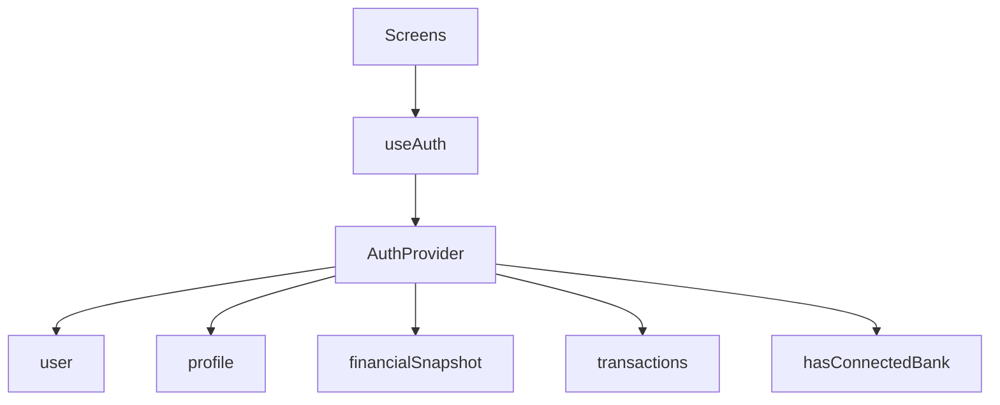

### Data Fetching Lifecycle

When the app starts:

1. `AuthProvider` calls `getCurrentUser()`.
2. If signed in, it loads `UserProfile`.
3. If profile exists, it loads:
   - bank connection state
   - transactions
   - financial snapshot
4. It routes the user to auth, onboarding, or tabs.

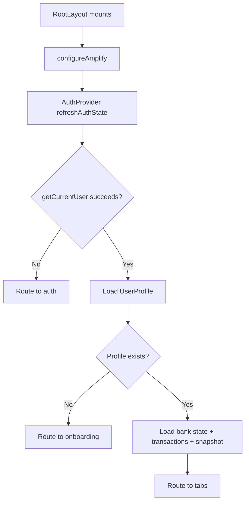

### Error Handling Strategy

Current frontend strategy:

- UI forms use local `error` state.
- AWS calls throw user-readable errors from service helpers.
- AuthProvider catches refresh failures and resets affected slices.
- Plaid and storage flows display inline errors instead of silently failing.
- AWS table access logs are emitted through `src/lib/awsDataLog.ts`.

### Local Storage / Caching

The app does not maintain a custom offline cache for profile or financial data. Amplify Auth stores session tokens internally. Profile, transaction, and snapshot data are loaded from AWS on auth refresh and explicit refresh flows.

This keeps the backend as the source of truth and avoids stale local profile data overriding newer backend data.

---

## 6. Authentication And Session Flow

### Files

| File | Role |
|---|---|
| `src/auth/AuthProvider.tsx` | Main auth/session/data provider |
| `src/auth/useAuth.ts` | Safe hook wrapper |
| `src/auth/userIdentity.ts` | Email normalization and signed-in identity helpers |
| `app/(auth)/sign-in.tsx` | Login form |
| `app/(auth)/sign-up.tsx` | Account creation |
| `app/(auth)/confirm-sign-up.tsx` | Email confirmation |
| `app/(auth)/forgot-password.tsx` | Password reset |
| `amplify/auth/resource.ts` | Cognito email login config |

### Auth Flow

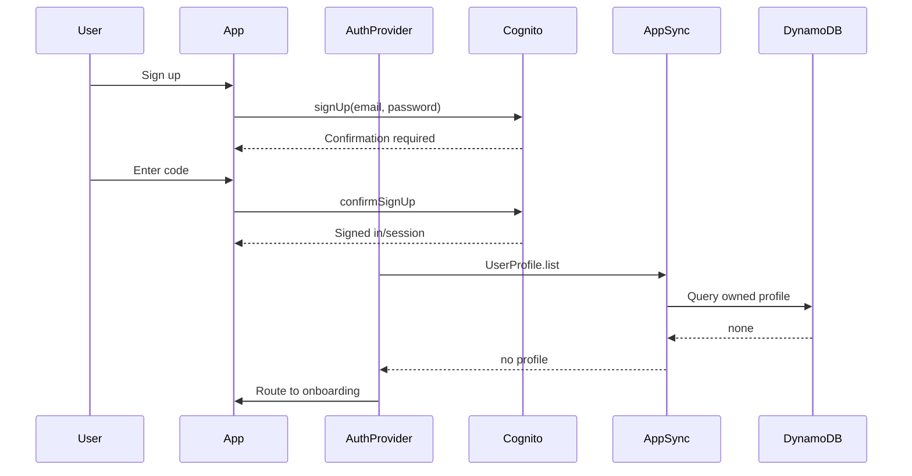

### Routing Guard Logic

| Condition | Destination |
|---|---|
| No user and not in auth group | `/(auth)/sign-in` |
| User exists but no profile | `/(onboarding)` |
| User and profile exist, not already in tabs/onboarding | `/(tabs)` |

---

## 7. Onboarding Flow

File: `app/(onboarding)/index.tsx`

Current onboarding has three stages:

1. Profile details
   - Name
   - Date of birth
   - Phone number
2. Optional profile image
   - Upload Image
   - Skip
3. Optional Plaid connection
   - Connect bank
   - Not now

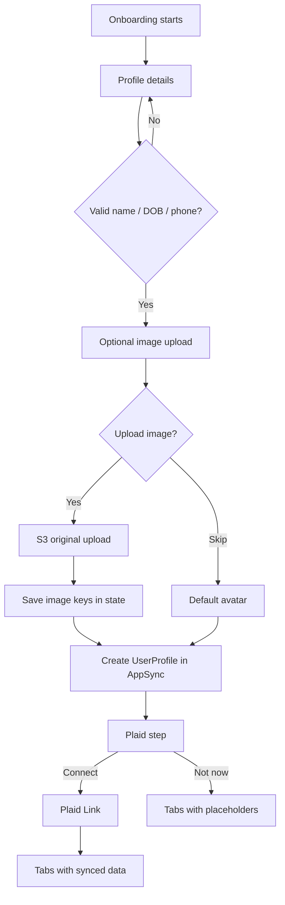

### Why Profile Is Created Before Plaid

Plaid exchange and sync are associated with the authenticated user. Creating the `UserProfile` before entering the main app gives every user a stable profile record, even if they skip bank linking. This is important because:

- profile settings can load consistently
- skipped-bank users still have a valid app session
- financial placeholders can be based on a known profile

---

## 8. Profile Editing And Image Upload

### Profile Screen

File: `src/components/SettingsDetails.tsx`

The profile slide-down screen is read-only by default. It shows:

- profile image
- name
- date of birth
- phone number
- username/email as read-only values
- linked account section
- sign out

The pencil button at the top-right of the profile image opens a floating edit modal.

### Editable Fields

Only these fields are editable:

| Field | Stored In | Validation |
|---|---|---|
| Name | `UserProfile.name` | Cannot be empty |
| Date of birth | `UserProfile.dateOfBirth` | Valid `YYYY-MM-DD`, before today |
| Phone number | `UserProfile.phoneNumber` | Reasonable phone format |
| Profile image | `UserProfile.profileImageKey` | JPEG/PNG/WebP, max 8 MB client check |

### Profile Edit Flow

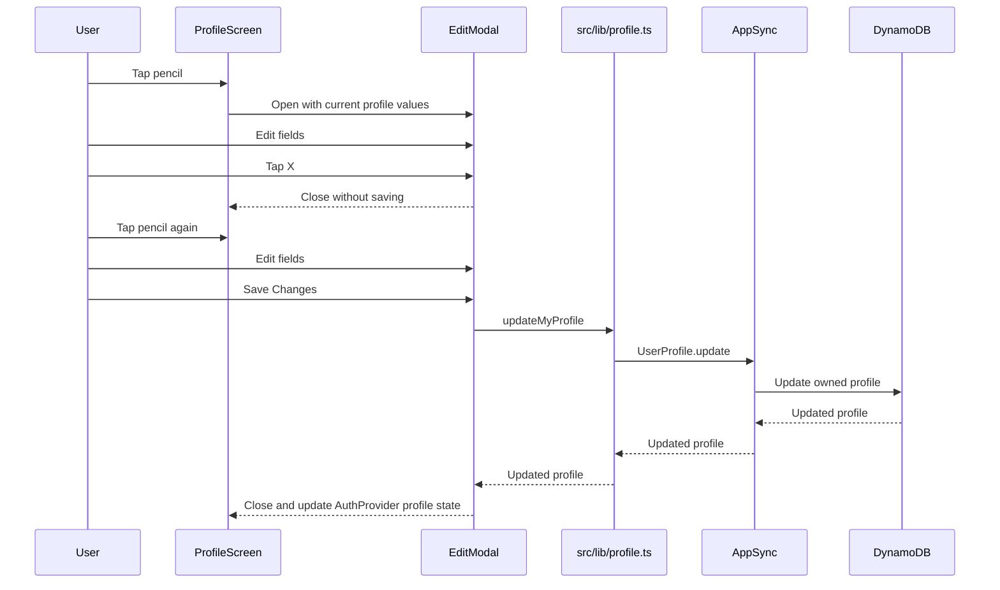

### Image Upload Pipeline

Files:

- `src/lib/profileImagePicker.ts`
- `src/lib/profileImage.ts`
- `src/components/ProfileAvatar.tsx`
- `amplify/storage/resource.ts`
- `amplify/functions/process-profile-image/handler.ts`

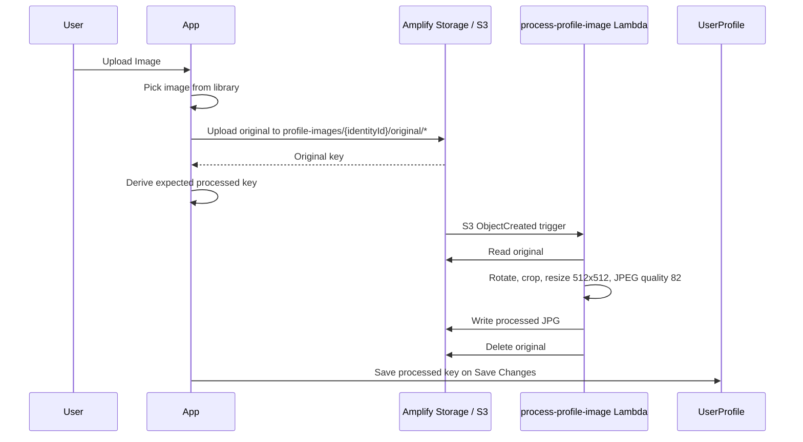

> Important: `expo-image-picker` is native. After installing it, rebuild the native app with `npx expo run:ios` or `npx expo run:android`.

---

## 9. Plaid Integration

Official docs:

- [Plaid docs](https://plaid.com/docs/)
- [Plaid Link](https://plaid.com/docs/link/)
- [Plaid API](https://plaid.com/docs/api/)

### Files

| File | Role |
|---|---|
| `src/lib/plaidApi.ts` | AppSync custom operation wrappers |
| `src/lib/plaidLink.ts` | Opens native Plaid Link and handles success/exit |
| `src/components/ConnectAccountDetails.tsx` | Connect account UI and sandbox fallback |
| `amplify/functions/create-plaid-link-token/handler.ts` | Creates Plaid Link token |
| `amplify/functions/exchange-plaid-public-token/handler.ts` | Exchanges public token, stores item/token, syncs transactions |
| `amplify/functions/sync-plaid-transactions/handler.ts` | Syncs transactions for existing Plaid items |
| `amplify/functions/_shared/plaid.ts` | Plaid request helper |
| `amplify/functions/_shared/sync.ts` | Account/transaction upsert logic |
| `amplify/functions/_shared/snapshot.ts` | Financial snapshot calculation |

### Link Token Flow

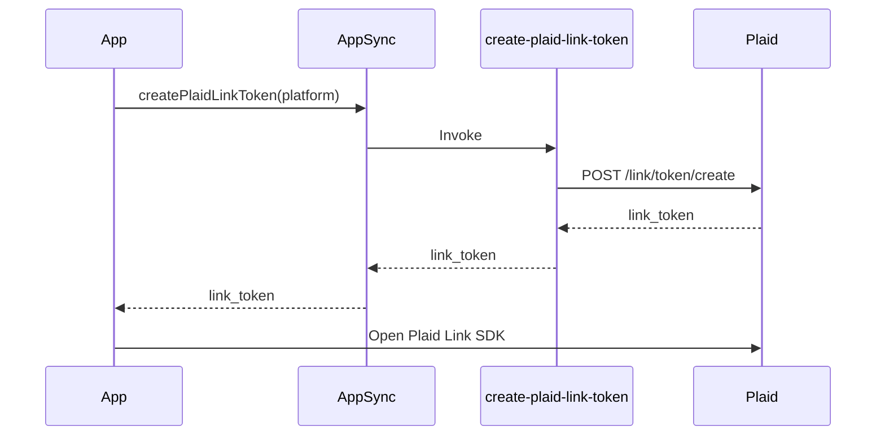

### Public Token Exchange Flow

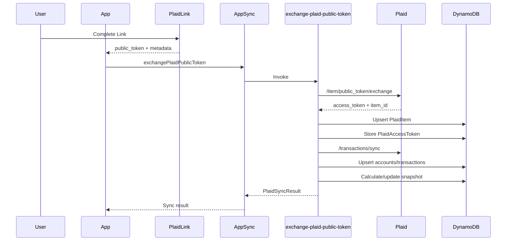

### Transaction Sync

Fluxa uses Plaid `/transactions/sync`, which is cursor-based. Each `PlaidItem` stores `transactions_cursor`. On each sync:

1. Load Plaid item.
2. Load matching `PlaidAccessToken`.
3. Call `/transactions/sync` with cursor.
4. Upsert accounts.
5. Upsert added and modified transactions.
6. Mark removed transactions as removed.
7. Save next cursor on `PlaidItem`.
8. Recalculate financial snapshot.

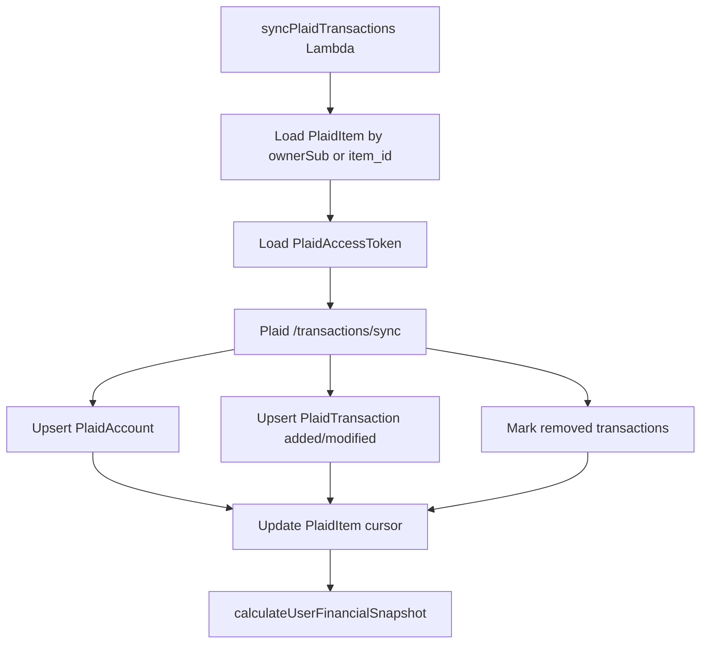

### Security Considerations

- Plaid client secret is stored as Amplify secrets.
- Plaid access tokens are only handled in Lambda.
- The client receives Link tokens and sync result metadata, not access tokens.
- `PlaidAccessToken` has owner-based authorization and is primarily written by backend functions.
- Logs mask token previews where possible.

### OAuth Redirect Support

The Link token Lambda includes platform-specific OAuth configuration:

- iOS uses `PLAID_IOS_REDIRECT_URI`.
- Android uses `PLAID_ANDROID_PACKAGE_NAME`.
- App scheme in `app.json`: `fluxa`.
- Android intent filter and iOS associated domain are configured for the Plaid return path.

---

## 10. AWS Backend Architecture

Official AWS docs:

- [AWS docs](https://docs.aws.amazon.com/)
- [AWS Lambda](https://docs.aws.amazon.com/lambda/)
- [Amazon S3](https://docs.aws.amazon.com/s3/)
- [Amazon Cognito](https://docs.aws.amazon.com/cognito/)
- [Amazon API Gateway](https://docs.aws.amazon.com/apigateway/)
- [Amazon DynamoDB](https://docs.aws.amazon.com/amazondynamodb/)

> Note: This app uses AppSync GraphQL through Amplify Data, not a custom API Gateway REST API for the current app data paths.

### Services Used

| AWS Service | Used For |
|---|---|
| Cognito | User authentication |
| AppSync | GraphQL API generated by Amplify Data |
| DynamoDB | Model-backed tables |
| Lambda | Plaid operations, financial snapshot, image processing |
| S3 | Profile image storage |
| IAM | Function/storage/data access |
| CloudWatch Logs | Lambda and app data-call tracing |

### Backend Definition Files

| File | Purpose |
|---|---|
| `amplify/backend.ts` | Registers backend resources |
| `amplify/auth/resource.ts` | Cognito login configuration |
| `amplify/data/resource.ts` | AppSync schema, models, custom operations |
| `amplify/storage/resource.ts` | S3 bucket, access rules, upload trigger |
| `amplify/functions/*/resource.ts` | Lambda resource config |
| `amplify/functions/*/handler.ts` | Lambda implementation |

### Lambda Functions

| Function | Trigger | Purpose |
|---|---|---|
| `create-plaid-link-token` | AppSync query | Create Plaid Link token |
| `exchange-plaid-public-token` | AppSync mutation | Exchange token, store Plaid item/token, sync transactions |
| `sync-plaid-transactions` | AppSync mutation | Refresh existing Plaid item transactions |
| `calculate-user-financial-snapshot` | AppSync mutation / called internally | Rebuild financial summary |
| `process-profile-image` | S3 upload trigger | Resize/crop image and save processed JPEG |

### Storage Rules

Storage path:

```txt
profile-images/{entity_id}/*
```

Access:

- Owner identity can read/write/delete.
- `process-profile-image` Lambda can read/write/delete.

This keeps profile images private and scoped to authenticated identities.

---

## 11. Data Model Reference

### UserProfile

Owner-authorized model storing user-editable profile data and some calculated/legacy financial fields.

| Field | Meaning |
|---|---|
| `email` | User email |
| `name` | Editable display name |
| `firstName` | Derived from name for compatibility/greeting |
| `dateOfBirth` | Editable DOB |
| `phoneNumber` | Editable phone |
| `profileImageKey` | Processed S3 image key |
| `originalProfileImageKey` | Original upload key, mostly historical because Lambda deletes original |
| `totalAssets` | Snapshot/financial value |
| `totalLiabilities` | Snapshot/financial value |
| `totalNetWorth` | Snapshot/financial value |
| `onboardingComplete` | Profile creation marker |

### UserFinancialSnapshot

Calculated financial summary. Rebuilt from Plaid accounts and transactions.

| Field Group | Examples |
|---|---|
| Net worth | `totalAssets`, `totalLiabilities`, `totalNetWorth` |
| Cash flow | `monthlyIncome`, `monthlyExpenses`, `monthlyCashFlow`, `savingsRate` |
| Spending insights | `topSpendingCategory`, `topSpendingCategoryAmount`, `recurringSubscriptionCount` |
| Counts | `connectedInstitutionCount`, `connectedAccountCount`, `transactionCount` |

### PlaidItem

Represents a linked Plaid item/institution.

Important fields:

- `ownerSub`
- `item_id`
- `institution_id`
- `institution_name`
- `transactions_cursor`
- `status`
- `needs_reauth`
- `sandbox_persona`

### PlaidAccessToken

Stores the Plaid `access_token`.

Important: this is sensitive and should only be handled server-side.

### PlaidAccount

Normalized Plaid accounts with balances and account metadata.

### PlaidTransaction

Normalized Plaid transactions, including categories, merchant information, counterparties, payment metadata, and removed-state tracking.

---

## 12. Data Flow Diagrams

### Frontend To Backend

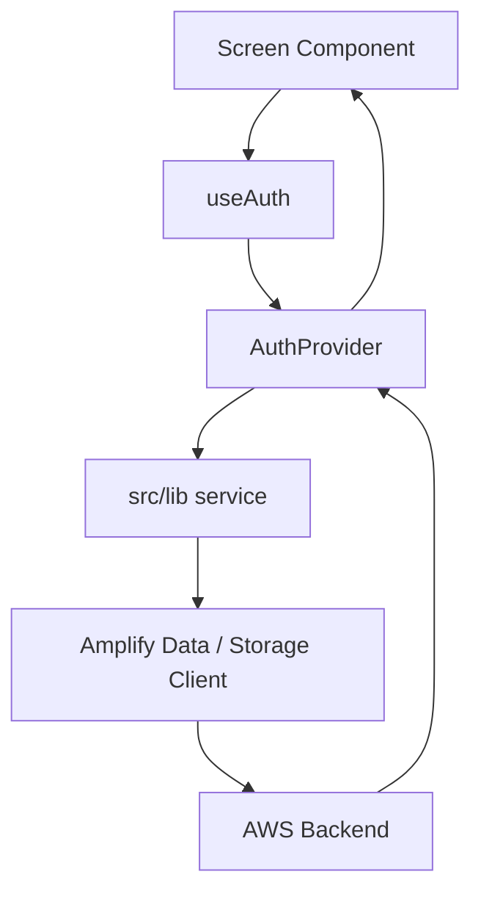

### Profile Update Flow

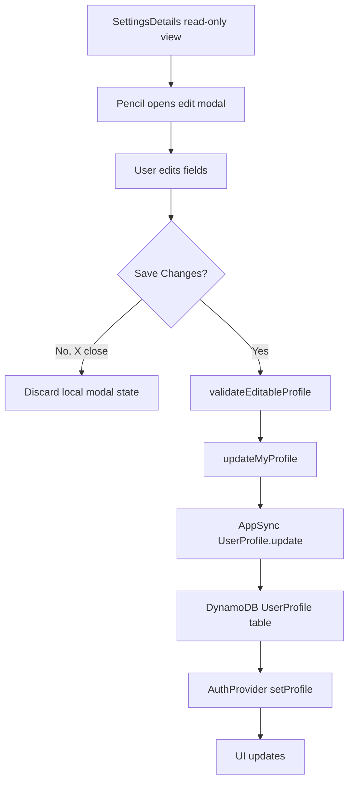

### Profile Image Flow

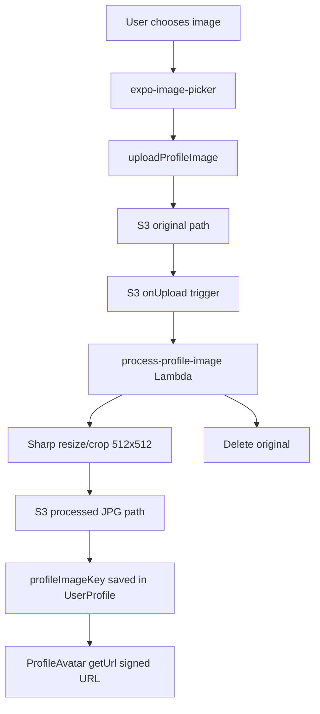

### Financial Snapshot Flow

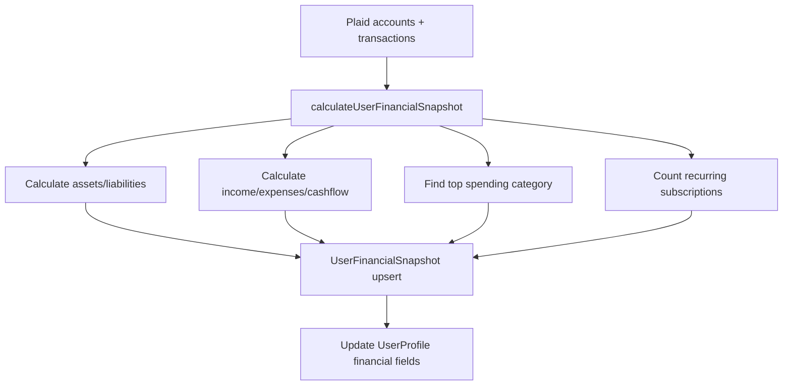

### Missing Bank Data Flow

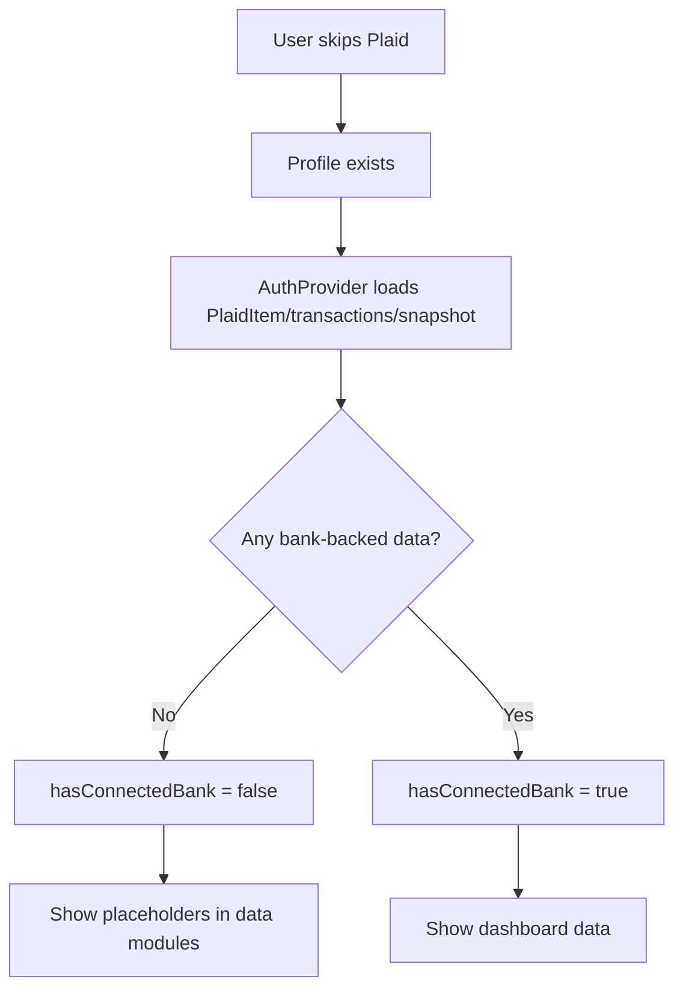

---

## 13. Major Modules And Responsibilities

### Frontend Modules

| Module | Responsibility |
|---|---|
| `src/auth/AuthProvider.tsx` | Session, profile, transactions, snapshots, routing decisions |
| `src/lib/profile.ts` | `UserProfile` create/update/delete/load |
| `src/lib/profileImage.ts` | S3 upload and signed URL helpers |
| `src/lib/profileImagePicker.ts` | Native image picker wrapper and rebuild guard |
| `src/lib/plaidApi.ts` | AppSync custom operation wrappers |
| `src/lib/plaidLink.ts` | Native Plaid Link orchestration |
| `src/lib/transactionStore.ts` | Transaction loading, Plaid sync before read |
| `src/lib/financialSnapshot.ts` | Snapshot read helper |
| `src/lib/financials.ts` | Formatting and financial totals helpers |
| `src/lib/transactions.ts` | Filtering, category totals, cash flow, subscriptions |
| `src/components/SettingsDetails.tsx` | Read-only profile panel and edit modal |
| `src/components/CalendarDatePicker.tsx` | Shared date picker UI |
| `src/components/BankDataPlaceholder.tsx` | Empty-state display for skipped Plaid |

### Backend Shared Modules

| Module | Responsibility |
|---|---|
| `_shared/dataClient.ts` | IAM-mode Amplify Data client for Lambdas |
| `_shared/event.ts` | Extract signed-in Cognito identity |
| `_shared/plaid.ts` | Plaid HTTP request helper and environment selection |
| `_shared/normalize.ts` | Convert Plaid responses into schema-ready records |
| `_shared/sync.ts` | Upsert accounts/transactions and update cursors |
| `_shared/snapshot.ts` | Calculate and persist financial snapshot |
| `_shared/dataLog.ts` | CloudWatch table-access log helper |

---

## 14. Setup And Local Development

### Prerequisites

- Node compatible with Expo/React Native. Current installed packages warn that some React Native tooling expects Node `>=20.19.4`.
- Xcode for iOS builds.
- Android Studio for Android builds.
- AWS credentials configured for Amplify sandbox/deploy.
- Plaid developer account.

### Install Dependencies

```bash
npm install
```

### Run The App

```bash
npm start
```

Native iOS build:

```bash
npx expo run:ios
```

Fresh iOS build without build cache:

```bash
npx expo run:ios --no-build-cache
```

Clear Metro cache:

```bash
npx expo start --clear
```

Native Android build:

```bash
npx expo run:android
```

### Why Native Rebuilds Are Sometimes Required

The app uses native modules:

- `react-native-plaid-link-sdk`
- `expo-image-picker`

Installing JS packages is not enough for an already-installed simulator binary. Rebuild the native app after adding/changing native modules.

---

## 15. Deployment Guide

### Amplify Sandbox

```bash
npx ampx sandbox
```

This deploys the local Amplify backend definitions and updates backend outputs.

### Required Plaid Secrets

Configured in function resources via `secret(...)`:

| Secret | Used By |
|---|---|
| `PLAID_CLIENT_ID` | Plaid API requests |
| `PLAID_SECRET` | Plaid API requests |
| `PLAID_ENV` | `sandbox`, `development`, or `production` |
| `PLAID_IOS_REDIRECT_URI` | iOS OAuth institutions |
| `PLAID_ANDROID_PACKAGE_NAME` | Android OAuth institutions |

Other environment values:

| Variable | Default / Current Use |
|---|---|
| `PLAID_CLIENT_NAME` | `Fluxa` |
| `PLAID_PRODUCTS` | `transactions` |
| `PLAID_COUNTRY_CODES` | `US` |
| `PLAID_LANGUAGE` | `en` |

### Backend Resources To Confirm After Deploy

- Cognito user pool exists.
- AppSync API exists.
- DynamoDB model tables exist.
- S3 bucket `fluxaProfileStorage` exists.
- `process-profile-image` has S3 trigger.
- Plaid functions have secrets resolved.
- Storage access policy allows owner access and Lambda access.

---

## 16. Troubleshooting

### Cannot Find Native Module `ExponentImagePicker`

Cause: the simulator app was built before `expo-image-picker` was included.

Fix:

```bash
npx expo run:ios --no-build-cache
npx expo start --clear
```

If needed, delete the simulator app and rebuild.

### Plaid Link Does Not Open In Expo Go

Plaid Link native SDK requires a development/native build. Use:

```bash
npx expo run:ios
```

or:

```bash
npx expo run:android
```

### OAuth Bank Does Not Return To App

Check:

- `app.json` scheme: `fluxa`
- iOS associated domain
- Android intent filters
- `PLAID_IOS_REDIRECT_URI`
- `PLAID_ANDROID_PACKAGE_NAME`

### Profile Image Upload Works But Image Does Not Show Immediately

The client derives the processed image key immediately, but Lambda processing is asynchronous. The local preview displays right away in the edit modal. After save/reload, the processed image must exist in S3 for signed URL loading.

### No Bank Data Appears

Check logs for:

```txt
[AWSData][TableAccess]
[PlaidFlow][App:Transactions]
[PlaidFlow][Lambda:*]
```

Confirm:

- `PlaidItem` exists for the owner.
- `PlaidAccessToken` exists for the item.
- `PlaidTransaction` records exist.
- `UserFinancialSnapshot.transactionCount` is greater than zero.

---

## 17. Security Notes

### Authentication

- Cognito owns user identity.
- AppSync model access uses owner authorization.
- AuthProvider derives route access from Cognito session and profile existence.

### Plaid

- Access tokens are exchanged and stored in Lambda.
- Client never sees Plaid access tokens.
- Token logs are masked.

### S3

- Profile images use authenticated owner paths.
- Bucket is not intentionally public.
- App loads images through signed URLs from Amplify Storage.

### IAM

- Amplify grants functions resource access through backend definitions.
- `process-profile-image` gets S3 read/write/delete only for configured storage paths.

### Developer Caution

Do not log:

- Plaid access tokens
- raw secrets
- full Cognito tokens
- private signed S3 URLs in production telemetry

---

## 18. Performance And Scalability Notes

### Current Strengths

- Serverless backend scales per request.
- DynamoDB is suitable for user-scoped financial records.
- Profile image processing is asynchronous.
- Plaid sync uses cursor-based incremental updates.

### Watch Areas

- `PlaidTransaction.list()` can become expensive if unbounded. Prefer owner/index queries and pagination for larger datasets.
- Snapshot calculation currently loads relevant accounts/transactions into Lambda memory.
- Profile image signed URLs expire and may need refresh logic in longer sessions.
- `sharp` Lambda cold starts can be heavier than simple functions.

### Potential Improvements

- Add Plaid webhooks for automatic transaction updates.
- Add pagination/infinite scroll for transaction lists.
- Add optimistic image refresh after Lambda completes.
- Add structured telemetry/error reporting.
- Add integration tests for Lambda sync and snapshot math.

---

## 19. Developer Notes And Future Work

### Known Limitations

- No Plaid webhook handler is currently implemented.
- Plaid sync is initiated after account linking and during transaction refreshes.
- Some financial category rows still use static categories in the UI.
- Profile image processing is asynchronous; processed image availability may lag upload.
- `originalProfileImageKey` is saved for traceability even though the Lambda deletes originals.

### Suggested Refactors

- Create a dedicated `src/features/profile/` folder as profile editing grows.
- Move profile edit modal into its own file if it becomes more complex.
- Create a shared `FormField` component.
- Add schema migration notes for existing users missing `name`, `dateOfBirth`, and `phoneNumber`.
- Add a backend-only encrypted pattern for Plaid access tokens if requirements tighten.

### Testing Gaps

Recommended future tests:

- Profile validation unit tests.
- Transaction utility unit tests.
- Plaid sync Lambda tests with mocked Plaid pages.
- Snapshot calculation tests.
- Profile image Lambda test with sample images.
- Auth routing tests for profile/no-profile states.

---

## 20. External Documentation

### Plaid

- [Plaid documentation](https://plaid.com/docs/)
- [Plaid Link](https://plaid.com/docs/link/)
- [Plaid API](https://plaid.com/docs/api/)

### AWS

- [AWS documentation](https://docs.aws.amazon.com/)
- [AWS Lambda](https://docs.aws.amazon.com/lambda/)
- [Amazon S3](https://docs.aws.amazon.com/s3/)
- [Amazon Cognito](https://docs.aws.amazon.com/cognito/)
- [Amazon API Gateway](https://docs.aws.amazon.com/apigateway/)
- [Amazon DynamoDB](https://docs.aws.amazon.com/amazondynamodb/)

### Expo / React Native

- Expo documentation: https://docs.expo.dev/
- Expo Router: https://docs.expo.dev/router/introduction/
- React Native: https://reactnative.dev/

---

## Quick Commands

```bash
# Install dependencies
npm install

# Start Metro
npm start

# iOS native build
npx expo run:ios

# iOS clean native build
npx expo run:ios --no-build-cache

# Clear Metro cache
npx expo start --clear

# Type check
npx tsc --noEmit

# Deploy Amplify sandbox
npx ampx sandbox
```

---

## Mental Model For New Engineers

If you remember only one thing, remember this:

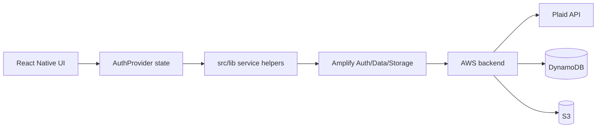

The frontend should stay declarative and user-focused. Persistent data belongs in Amplify models. Sensitive Plaid and image-processing work belongs in Lambda. Binary assets belong in S3. AuthProvider is the bridge that keeps the app’s UI state synchronized with the backend source of truth.
